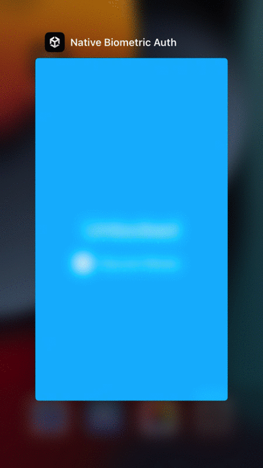
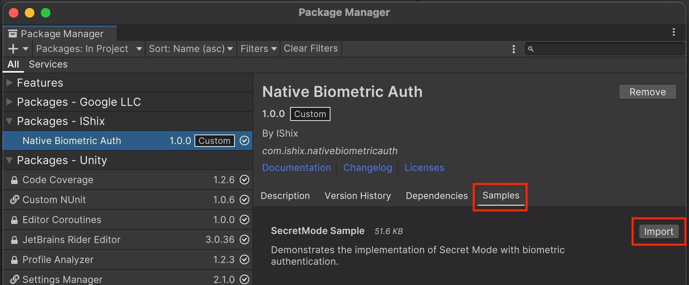
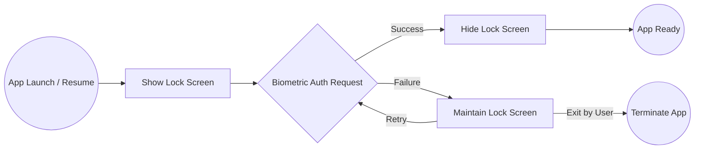
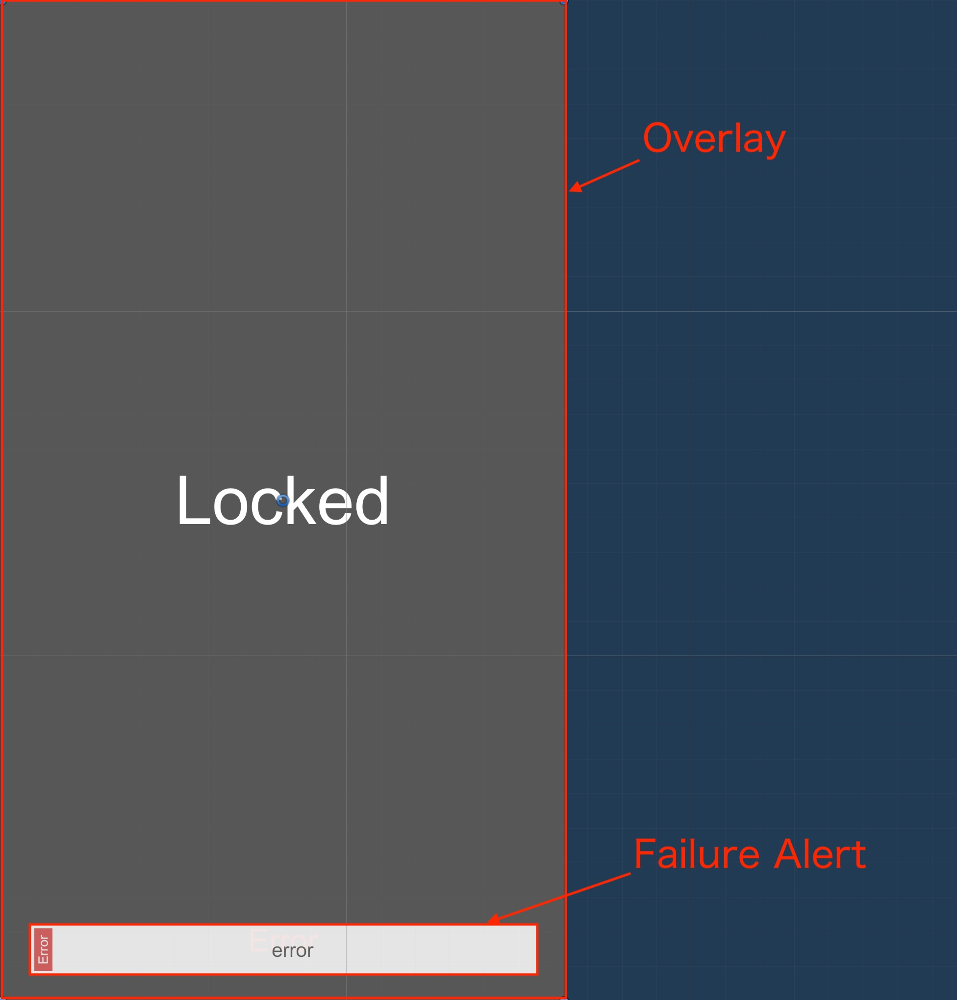
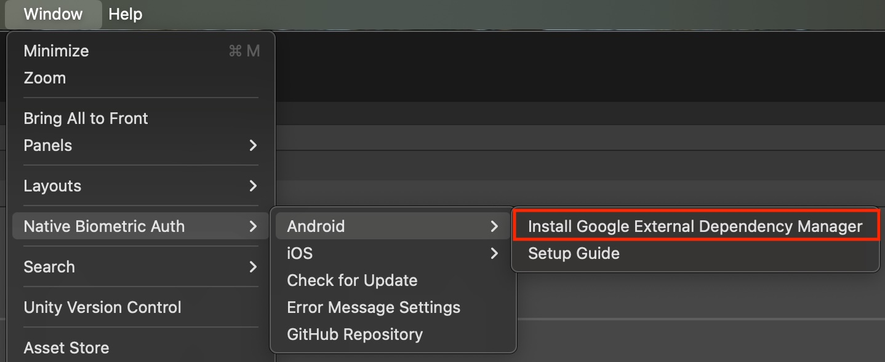
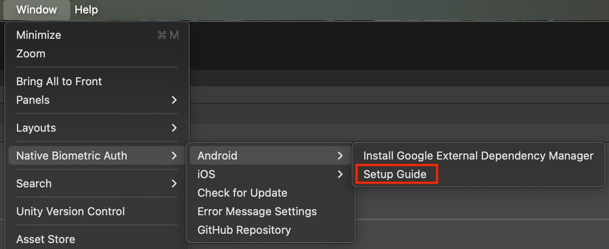
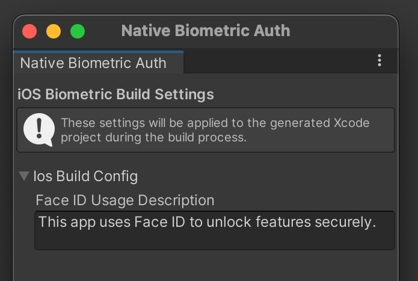
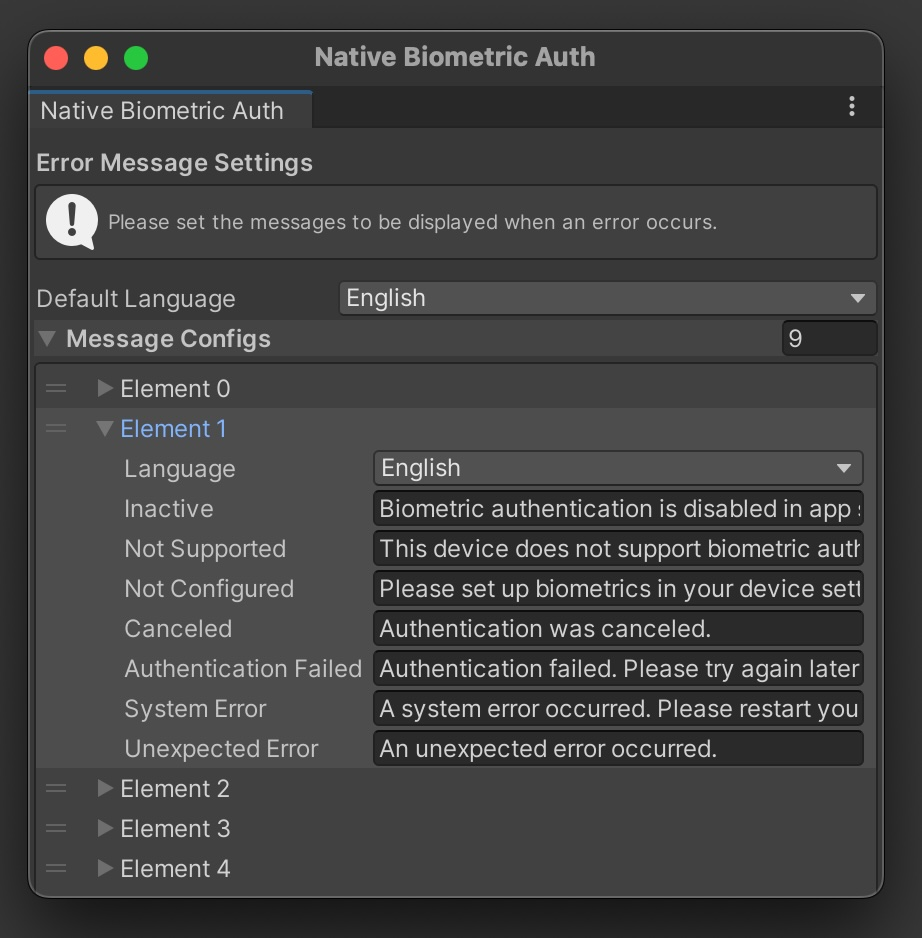
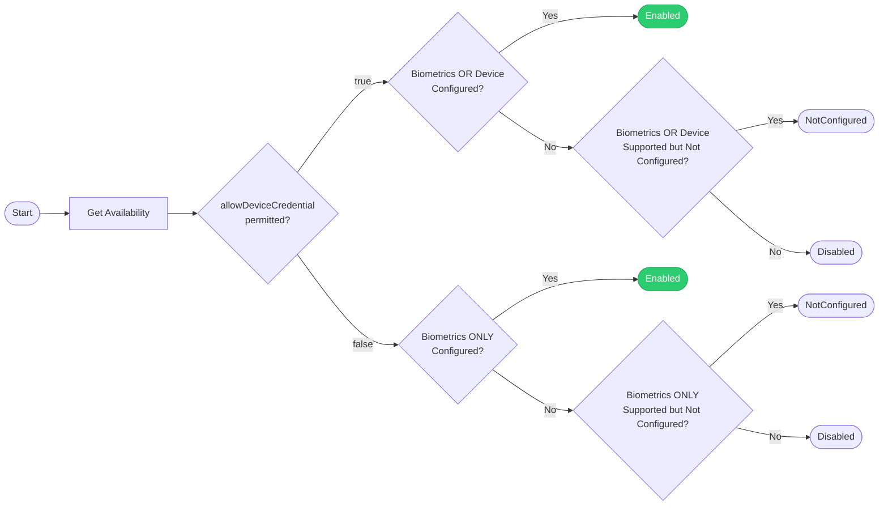

[README - 日本語版](README_ja.md)

# Native Biometric Auth

A native biometric authentication library (FaceID, TouchID, Fingerprint) for Unity.
It allows for the implementation of a "Secret Mode" to protect sensitive information within your app with minimal effort.



## Requirements

* **iOS**: 12.0+
* **Android**: API Level 23 (6.0)+
* **macOS**: 10.13+

Supports biometric authentication simulation within the Unity Editor (Mac).

## Getting Started

### Installation (UPM)

In the Unity Editor, go to `Window > Package Manager > Add package from git URL...` and enter the following URL:

```
https://github.com/IShix-g/NativeBiometricAuth.git?path=Packages/com.ishix.nativebiometricauth#v1
```

## Quick Start

### 1. Import Samples

In the Package Manager, select the `Native Biometric Auth` package and import the **SecretMode Sample**.

`Window > Package Manager > Native Biometric Auth > Samples > SecretMode Sample`



### 2. Check the Sample Scene

Open and play `Assets/Samples/Native Biometric Auth/1.0.0/SecretMode Sample/SecretModeTest.cs`.

* **macOS**: You can simulate biometric authentication while running in the Editor.
* **Android**: Before testing on an actual device, please complete the "Android Settings" described below.

## Secret Mode Specifications

Secret Mode is a feature that triggers a lock UI and forces user authentication based on specific app states.

### Workflow

1. **Authentication Triggers**:
* App launch (Cold Start)
* Returning from background (Resume) ([OnApplicationPause(false)](https://docs.unity3d.com/6000.3/Documentation/ScriptReference/MonoBehaviour.OnApplicationPause.html))


2. **Authentication Process**:
* Upon trigger detection, the **Lock UI** is immediately displayed at the front.
* Requests OS-standard biometric authentication (FaceID / TouchID / Fingerprint, etc.).


3. **State Transitions**:
* **Success**: Hides the Lock UI and returns to the previous context.
* **Failure**: Maintains the locked state.




### Switching Modes (UI Components)

Various components are provided to easily toggle Secret Mode on or off.

* **[SecretModeToggle.cs](https://github.com/IShix-g/NativeBiometricAuth/blob/main/Packages/com.ishix.nativebiometricauth/Runtime/Scripts/Public/SecretMode/Component/SecretModeToggle.cs)**: For `UI.Toggle`
* **[SecretModeButton.cs](https://github.com/IShix-g/NativeBiometricAuth/blob/main/Packages/com.ishix.nativebiometricauth/Runtime/Scripts/Public/SecretMode/Component/SecretModeButton.cs)**: For `UI.Button` `TextMeshPro`
* **[SecretModeButtonLegacy.cs](https://github.com/IShix-g/NativeBiometricAuth/blob/main/Packages/com.ishix.nativebiometricauth/Runtime/Scripts/Public/SecretMode/Component/SecretModeButtonLegacy.cs)**: For `UI.Button` `UI.Text`

> [!TIP]
> To create your own switching logic, inherit from `SecretModeObserver`.

## Lock UI Setup

The Secret Mode UI consists of the following components:

* **Overlay**: The primary UI displayed while the app is locked.
* **Failure Alert**: A feedback UI shown when biometric authentication fails.

> [!TIP]
> **Custom Lock UI**
> To use a custom UI, create a Prefab that implements the `ISecretModeObject` interface and pass it during initialization.
> Reference Implementation: [TestSecretModeObject.cs](https://github.com/IShix-g/NativeBiometricAuth/blob/main/Packages/com.ishix.nativebiometricauth/Samples~/SecretModeTest/TestSecretModeObject.cs)



### Lock UI Lifecycle Management

By default, the lock UI Prefab is instantiated during initialization and persists until the application terminates.

If you need to manually control the lifecycle (e.g., for dynamic resource loading or custom pooling), implement the `ISecretModeObjectController` interface and provide it during initialization.

* **Interface Definition**: [ISecretModeObjectController.cs](https://github.com/IShix-g/NativeBiometricAuth/blob/main/Packages/com.ishix.nativebiometricauth/Runtime/Scripts/Public/SecretMode/ISecretModeObjectController.cs)
* **Default Implementation**: [PrefabSecretModeOverlayController.cs](https://github.com/IShix-g/NativeBiometricAuth/blob/main/Packages/com.ishix.nativebiometricauth/Runtime/Scripts/Public/SecretMode/PrefabSecretModeOverlayController.cs)
* *This class handles the standard instantiation and destruction logic.*

---

## Platform Settings

### Android

On Android, this library uses "[External Dependency Manager for Unity (EDM4U)](https://github.com/googlesamples/unity-jar-resolver?tab=readme-ov-file#external-dependency-manager-for-unity)" to resolve the [AndroidX Biometric](https://developer.android.com/jetpack/androidx/releases/biometric) dependency.

#### 1. **Install EDM4U**

> [!IMPORTANT]
> If EDM4U is already installed in your project, no further action is required.

Run `Window > Native Biometric Auth > Android > Install Google External Dependency Manager`.



#### 2. **Setup**

Open `Setup Guide` from the menu and complete the configuration.



### iOS

Set the `NSFaceIDUsageDescription` (the reason for using FaceID) added to `Info.plist`.

`Window > Native Biometric Auth > iOS > Settings`

* **Default**: `This app uses Face ID to unlock features securely.`



---

## Main API

### Initialization

Use the `SecretMode` class to perform initialization.

| Parameter | Description | Default Value |
| --- | --- |---------------|
| `overlayPrefab` | Prefab for the Lock UI implementing `ISecretModeObject` | -             |
| `allowDeviceCredential` | Whether to allow passcode/pattern if biometrics are unavailable | `true`        |
| `resumeGraceSeconds` | Grace period (seconds) before requiring auth on resume | `10`          |

```csharp
using NativeBiometricAuth;

void Awake()
{
    if (!SecretMode.IsInitialized)
    {
        SecretMode.Initialize(
            overlayPrefab: _overlayPrefab,
            allowDeviceCredential: true,
            resumeGraceSeconds: 10
        );
    }
}
```

### Event Handling

| Event Name | Description |
| --- | --- |
| OnSecretModeActiveChanged | Called when Secret Mode is enabled or disabled. |
| OnAuthenticateSuccess | Called when biometric authentication succeeds. |
| OnAuthenticateFailure | Called when biometric authentication fails. You can check the [failure reason](https://github.com/IShix-g/NativeBiometricAuth/blob/main/Packages/com.ishix.nativebiometricauth/Runtime/Scripts/Public/Biometric/BiometricFailureReason.cs) via the argument. |

```csharp
using NativeBiometricAuth;

void OnEnable()
{
    SecretMode.OnSecretModeActiveChanged += OnSecretModeActiveChanged;
    SecretMode.OnAuthenticateSuccess += OnAuthenticateSuccess;
    SecretMode.OnAuthenticateFailure += OnAuthenticateFailure;
}

void OnDisable()
{
    SecretMode.OnSecretModeActiveChanged -= OnSecretModeActiveChanged;
    SecretMode.OnAuthenticateSuccess -= OnAuthenticateSuccess;
    SecretMode.OnAuthenticateFailure -= OnAuthenticateFailure;
}

void OnSecretModeActiveChanged(bool isActive) => Debug.Log($"Secret Mode: {isActive}");
void OnAuthenticateSuccess() => Debug.Log("Auth Success");
void OnAuthenticateFailure(BiometricFailureReason reason) => Debug.Log($"Auth Failed: {reason}");
```

### Localization & Messages

You can retrieve error messages based on [BiometricFailureReason](https://github.com/IShix-g/NativeBiometricAuth/blob/main/Packages/com.ishix.nativebiometricauth/Runtime/Scripts/Public/Biometric/BiometricFailureReason.cs).

```csharp
var message = BiometricSettings.Instance.GetMessage(reason, Application.systemLanguage);

```

Default message templates can be customized here:
`Window > Native Biometric Auth > Error Message Settings`



---

## Standalone Biometric Authentication

It is possible to use the biometric authentication features independently without using the "Secret Mode."

### 1. Enabling / Disabling Biometrics

Use this method to toggle the active state of biometric authentication within your application.

| Parameter | Description | Default |
| --- | --- | --- |
| `value` | Set to `true` to enable, `false` to disable. | - |
| `allowDeviceCredential` | Whether to allow Device Credentials (PIN, Pattern, Password) if biometrics are unavailable. | - |
| `authenticate` | If `true`, triggers a biometric check immediately to verify the user before enabling. | `true` |
| `onSuccess` | Callback invoked upon successful authentication. | `null` |
| `onFailure` | Callback invoked upon failed authentication. Returns [BiometricFailureReason](https://github.com/IShix-g/NativeBiometricAuth/blob/main/Packages/com.ishix.nativebiometricauth/Runtime/Scripts/Public/Biometric/BiometricFailureReason.cs). | `null` |

```csharp
using NativeBiometricAuth;

Biometric.SetActive(
    value: isActive,
    allowDeviceCredential: true,
    authenticate: true,
    onSuccess: () =>
    {
        NotifyAuthenticateSuccess();
        onSuccess?.Invoke();
    },
    onFailure: reason =>
    {
        NotifyAuthenticateFailure(reason);
        onFailure?.Invoke(reason);
    });

```

### 2. Checking Status

You can check the current activation state and hardware availability.

```csharp
using NativeBiometricAuth;

// Returns the state set via SetActive.
var isActive = Biometric.IsActive;

// Checks if the device/OS supports biometric authentication.
var isAvailable = Biometric.IsAvailable(allowDeviceCredential: true);

```

#### Detailed Availability Logic

The underlying logic for determining availability can be complex depending on OS settings (e.g., hardware support vs. user enrollment). The following flow chart illustrates how `BiometricActivationState` is determined.



### 3. Executing Authentication

Manually trigger the biometric authentication dialog.

| Parameter | Description | Default |
| --- | --- | --- |
| `allowDeviceCredential` | Whether to allow Device Credentials (PIN, Pattern, Password) as a fallback. | - |
| `onSuccess` | Callback invoked upon successful authentication. | `null` |
| `onFailure` | Callback invoked upon failed authentication. Returns [BiometricFailureReason](https://github.com/IShix-g/NativeBiometricAuth/blob/main/Packages/com.ishix.nativebiometricauth/Runtime/Scripts/Public/Biometric/BiometricFailureReason.cs). | `null` |

```csharp
using NativeBiometricAuth;

Biometric.Authenticate(
    allowDeviceCredential: true,
    onSuccess: () =>
    {
        // Handle success
    },
    onFailure: reason =>
    {
        // Handle failure (e.g., user cancellation, lockout, etc.)
    });

```