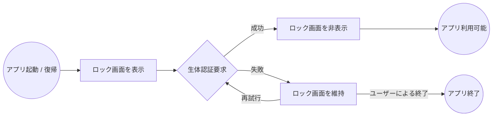
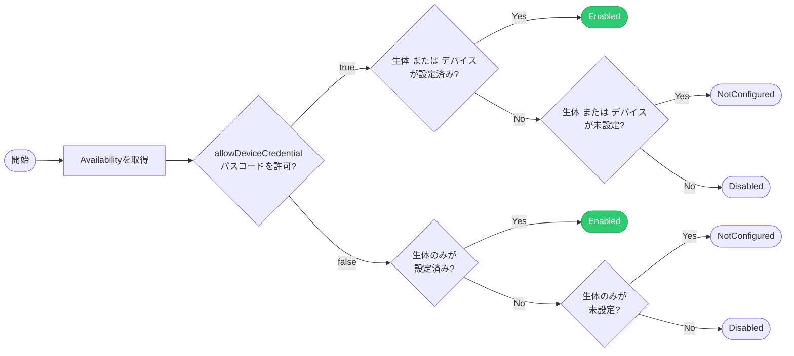

# Native Biometric Auth

Unity向けネイティブ生体認証（FaceID, TouchID, 指紋認証）ライブラリです。
アプリの機密情報を保護するための「シークレットモード」を最小限の実装で導入できます。


## 動作環境

* **iOS**: 12.0+
* **Android**: API Level 23 (6.0)+
* **macOS**: 10.13+

Unity Editor(Mac)上での生体認証にも対応

## Getting Started

### インストール (UPM)

`Window > Package Manager > Add package from git URL...` から以下のURLを入力してください。

```
https://github.com/IShix-g/NativeBiometricAuth.git?path=Packages/com.ishix.nativebiometricauth#v1
```

## Quick Start

### 1. サンプルのインポート

Package Managerの `Native Biometric Auth` 項目から **SecretMode Sample** をインポートします。

`Window > Package Manager > Native Biometric Auth > Samples > SecretMode Sample`


### 2. サンプルシーンの確認

`Samples/SecretMode Sample/SecretModeTest.unity` を開いて再生してください。

* **macOS**: エディタ実行中に生体認証のシミュレーションが可能です。
* **Android**: 実機テストの前に後述の「Androidの設定」を完了させてください。

## シークレットモードの仕様

シークレットモードは、アプリの特定の状態をトリガーにロックUIを表示し、ユーザー認証を強制する機能です。

### 動作フロー

1. **認証トリガー**:
* アプリ起動時（コールドスタート）
* バックグラウンドからの復帰時（[OnApplicationPause(false)](https://docs.unity3d.com/6000.3/Documentation/ScriptReference/MonoBehaviour.OnApplicationPause.html))


2. **認証プロセス**:
* トリガー検知後、即座に**ロックUI**を最前面に表示。
* OS標準の生体認証（FaceID / TouchID / 指紋認証等）を要求。


3. **状態遷移**:
* **成功**: ロックUIを非表示にし、直前の画面へ復帰。
* **失敗**: ロック状態を維持。




### モードの切り替え（UIコンポーネント）

シークレットモードの有効/無効を切り替えるための各種コンポーネントを提供しています。

* **[SecretModeToggle.cs](https://github.com/IShix-g/NativeBiometricAuth/blob/main/Packages/com.ishix.nativebiometricauth/Runtime/Scripts/Public/SecretMode/Component/SecretModeToggle.cs)**: `UI.Toggle` 用
* **[SecretModeButton.cs](https://github.com/IShix-g/NativeBiometricAuth/blob/main/Packages/com.ishix.nativebiometricauth/Runtime/Scripts/Public/SecretMode/Component/SecretModeButton.cs)**: `UI.Button`用 `TextMeshPro`
* **[SecretModeButtonLegacy.cs](https://github.com/IShix-g/NativeBiometricAuth/blob/main/Packages/com.ishix.nativebiometricauth/Runtime/Scripts/Public/SecretMode/Component/SecretModeButtonLegacy.cs)**: `UI.Button`用 `UI.Text`

> [!TIP]
> 独自の切り替えロジックを作成する場合は、`SecretModeObserver` を継承して実装してください。

### ロックUIの設定

シークレットモードで使用するUIには、以下のコンポーネントを設定します。

* **Overlay**: ロック中に表示されるメインUI
* **Failure Alert**: 認証失敗時に表示される警告UI

> [!TIP]
> 完全にカスタムしたロックUIを作成する場合は、`ISecretModeObject` インターフェースを実装してください。


---

## プラットフォーム別設定

### Android

Androidでは、依存ライブラリ [AndroidX Biometric](https://developer.android.com/jetpack/androidx/releases/biometric) を解決するために「External Dependency Manager for Unity (EDM4U)」を使用します。

1. **EDM4Uのインストール**:
   `Window > Native Biometric Auth > Android > Install Google External Dependency Manager` を実行します
2. **セットアップ**:
   メニューの `Setup Guide` を開き、設定を完了させてください

> [!IMPORTANT]
> すでにプロジェクトに EDM4U が導入されている場合は、再インストールの必要はありません。

### iOS

`Info.plist` に追加される `NSFaceIDUsageDescription`（FaceIDの使用理由）を設定します。

`Window > Native Biometric Auth > iOS > Settings`

* **初期値**: `This app uses Face ID to unlock features securely.`


---

## 主要API

### 初期化

`s` クラスを使用して初期化を行います。

| パラメータ | 説明 | デフォルト値 |
| --- | --- |--------|
| `overlayPrefab` | `ISecretModeObject` を実装したロックUIのPrefab | -      |
| `allowDeviceCredential` | 生体認証不可時にパスコード/パターン認証を許可するか | `true` |
| `resumeGraceSeconds` | 復帰時に認証を免除する猶予時間（秒） | `10`   |

```csharp
using NativeBiometricAuth;

void Awake()
{
    if (!SecretMode.IsInitialized)
    {
        SecretMode.Initialize(
            overlayPrefab: _overlayPrefab,
            allowDeviceCredential: true,
            resumeGraceSeconds: 10
        );
    }
}
```

### イベントハンドリング

| イベント名 | 説明 |
|---------------------------|---------------------------------------|
| OnSecretModeActiveChanged | シークレットモードの有効/無効の切り替え時に呼ばれます |
| OnAuthenticateSuccess | 生体認証が成功した際に呼ばれます |
| OnAuthenticateFailure | 生体認証が失敗した際に呼ばれます。引数で[エラー内容](https://github.com/IShix-g/NativeBiometricAuth/blob/main/Packages/com.ishix.nativebiometricauth/Runtime/Scripts/Public/Biometric/BiometricFailureReason.cs)を確認できます |

```csharp
using NativeBiometricAuth;

void OnEnable()
{
    SecretMode.OnSecretModeActiveChanged += OnSecretModeActiveChanged;
    SecretMode.OnAuthenticateSuccess += OnAuthenticateSuccess;
    SecretMode.OnAuthenticateFailure += OnAuthenticateFailure;
}

void OnDisable()
{
    SecretMode.OnSecretModeActiveChanged -= OnSecretModeActiveChanged;
    SecretMode.OnAuthenticateSuccess -= OnAuthenticateSuccess;
    SecretMode.OnAuthenticateFailure -= OnAuthenticateFailure;
}

void OnSecretModeActiveChanged(bool isActive) => Debug.Log($"Secret Mode: {isActive}");
void OnAuthenticateSuccess() => Debug.Log("Auth Success");
void OnAuthenticateFailure(BiometricFailureReason reason) => Debug.Log($"Auth Failed: {reason}");
```

### ローカライズ・メッセージ

[BiometricFailureReason](https://github.com/IShix-g/NativeBiometricAuth/blob/main/Packages/com.ishix.nativebiometricauth/Runtime/Scripts/Public/Biometric/BiometricFailureReason.cs) に基づいたエラーメッセージを取得できます。

```csharp
var message = BiometricSettings.Instance.GetMessage(reason, Application.systemLanguage);

```

メッセージの定型文は以下からカスタマイズ可能です：
`Window > Native Biometric Auth > Error Message Settings`


---

## 生体認証機能の利用

シークレットモードを使用せず、純粋な生体認証機能のみをスタンドアロンで利用する際の手順です。

### 1. 有効/無効の切り替え

生体認証の有効状態を切り替えます。

| 引数 | 説明 | 初期値 |
| --- | --- | --- |
| `value` | 有効化する場合は `true` 、無効化する場合は `false` | - |
| `allowDeviceCredential` | 生体認証が利用不可な際、デバイスの資格情報（パスコード/パターン等）を許可するか | - |
| `authenticate` | 有効化の際、その場で生体認証（本人確認）を行うか | `true` |
| `onSuccess` | 認証成功時のコールバック | `null` |
| `onFailure` | 認証失敗時のコールバック。引数で[エラー理由](https://github.com/IShix-g/NativeBiometricAuth/blob/main/Packages/com.ishix.nativebiometricauth/Runtime/Scripts/Public/Biometric/BiometricFailureReason.cs)を取得可能 | `null` |

```csharp
using NativeBiometricAuth;

Biometric.SetActive(
    value: isActive,
    allowDeviceCredential: true,
    authenticate: true,
    onSuccess: () =>
    {
        NotifyAuthenticateSuccess();
        onSuccess?.Invoke();
    },
    onFailure: reason =>
    {
        NotifyAuthenticateFailure(reason);
        onFailure?.Invoke(reason);
    });

```

### 2. 設定状態の確認

現在の生体認証の設定状態を取得します。

```csharp
using NativeBiometricAuth;

// 有効化されているか（SetActiveで設定した値）
var isActive = Biometric.IsActive;

// そもそもデバイスで生体認証が利用可能か
var isAvailable = Biometric.IsAvailable(allowDeviceCredential: true);

```

#### 利用可能判定の詳細（GetActivationState）

OS側の設定状況（未設定・未サポート等）に応じた詳細な判定フローは以下の通りです。



### 3. 生体認証の実行

明示的に生体認証ダイアログを表示し、認証を行います。

| 引数 | 説明 | 初期値 |
| --- | --- | --- |
| `allowDeviceCredential` | 生体認証が利用不可な際、デバイスの資格情報（パスコード/パターン等）を許可するか | - |
| `onSuccess` | 認証成功時のコールバック | `null` |
| `onFailure` | 認証失敗時のコールバック。[BiometricFailureReason](https://github.com/IShix-g/NativeBiometricAuth/blob/main/Packages/com.ishix.nativebiometricauth/Runtime/Scripts/Public/Biometric/BiometricFailureReason.cs)で詳細を確認可能 | `null` |

```csharp
using NativeBiometricAuth;

Biometric.Authenticate(
    allowDeviceCredential: true,
    onSuccess: () =>
    {
        // 成功時の処理
    },
    onFailure: reason =>
    {
        // 失敗時の処理
    });

```